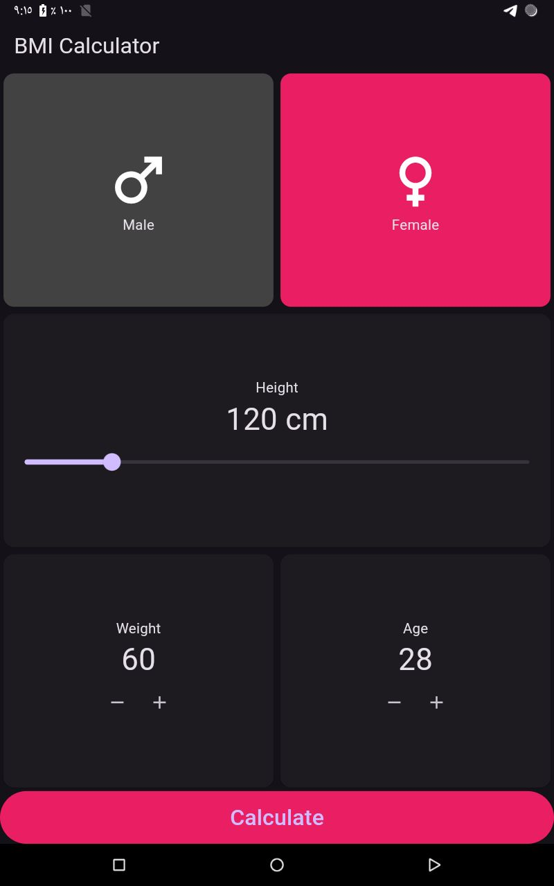
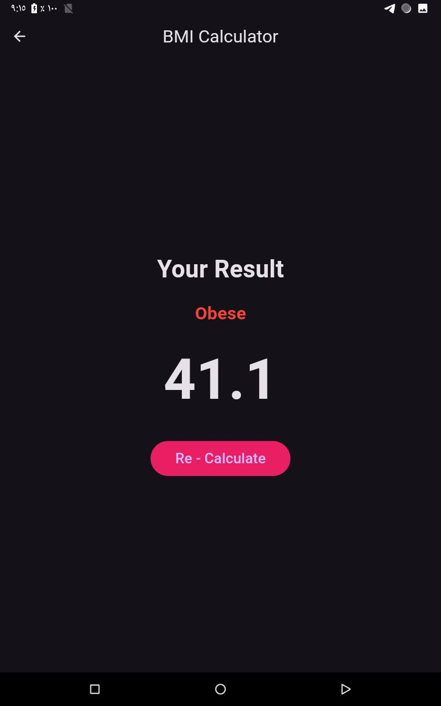

# 📱 BMI Calculator (Flutter)

## 🧠 فكرة التطبيق

تطبيق **BMI Calculator** هو تطبيق مبني باستخدام **Flutter** لحساب مؤشر كتلة الجسم (Body Mass Index) بناءً على:

* الطول (cm)
* الوزن (kg)

ويعرض للمستخدم حالته الصحية:

* Underweight
* Normal
* Overweight
* Obese

---

## 🧩 مميزات التطبيق

* واجهة بسيطة وسهلة الاستخدام
* دعم Dark Mode
* Slider لاختيار الطول
* أزرار (+ / -) لتغيير الوزن والعمر
* حساب BMI بدقة
* شاشة نتائج واضحة في منتصف الشاشة
* زر لإعادة الحساب

---

## 🗂️ هيكل المشروع

```
lib/
 ├─ main.dart
 ├─ home_screen.dart
 └─ result_screen.dart
```

---

## 📐 معادلة حساب BMI

```
BMI = الوزن / (الطول بالمتر × الطول بالمتر)
```

> ملاحظة: يتم تحويل الطول من سنتيمتر إلى متر داخل الكود.

---
## 🖥️ الشاشات / 📸 Screenshots

<table>
  <tr>
    <td>
      <p align="center">🏠 Home Screen</p>
      
    </td>
    <td>
      <p align="center">📊 Result Screen</p>
      
    </td>
  </tr>
</table>

---

## 🖥️ الشاشات

### 1️⃣ Home Screen

* اختيار الجنس (Male / Female)
* تحديد الطول باستخدام Slider
* تحديد الوزن والعمر باستخدام أزرار
* زر Calculate للانتقال لشاشة النتيجة

> هذه الشاشة من نوع **StatefulWidget** لأن البيانات تتغير.

---

### 2️⃣ Result Screen

* عرض حالة الجسم (Normal / Overweight...)
* عرض قيمة BMI
* تغيير لون النص حسب النتيجة
* زر Re-Calculate للرجوع للشاشة الأولى

> هذه الشاشة من نوع **StatelessWidget** لأنها تعرض بيانات فقط.

---

## 🚀 تشغيل المشروع

### 1. تثبيت الحزم

```bash
flutter pub get
```

### 2. تشغيل التطبيق

```bash
flutter run
```

> في حالة وجود مشاكل، يُفضل تنفيذ:

```bash
flutter clean
flutter pub get
```

---

## ⚙️ المتطلبات

* Flutter SDK >= 3.0.0
* Dart SDK >= 3.0.0
* Android Studio أو VS Code

---

## 🧑‍🎓 مناسب لـ

* طلاب Flutter
* مشاريع تدريبية
---


## 👨‍💻 المطور

تم تنفيذ التطبيق كجزء من تدريب عملي على Flutter.

---
